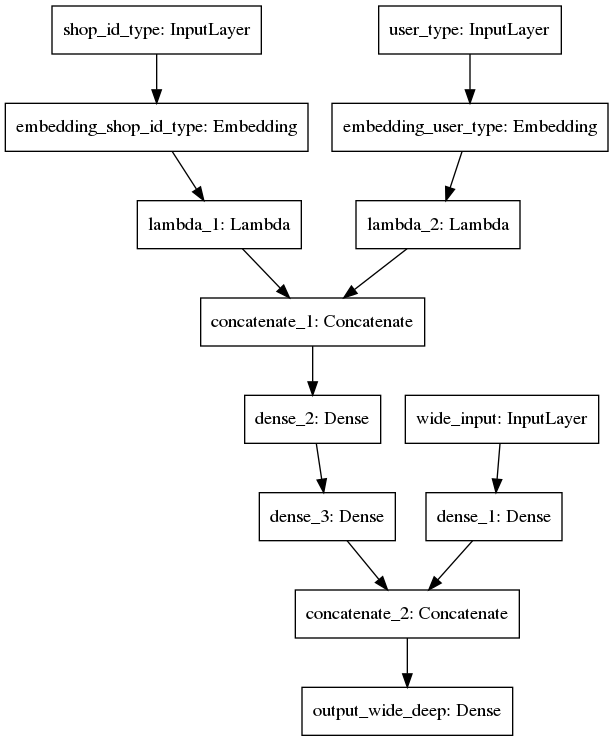
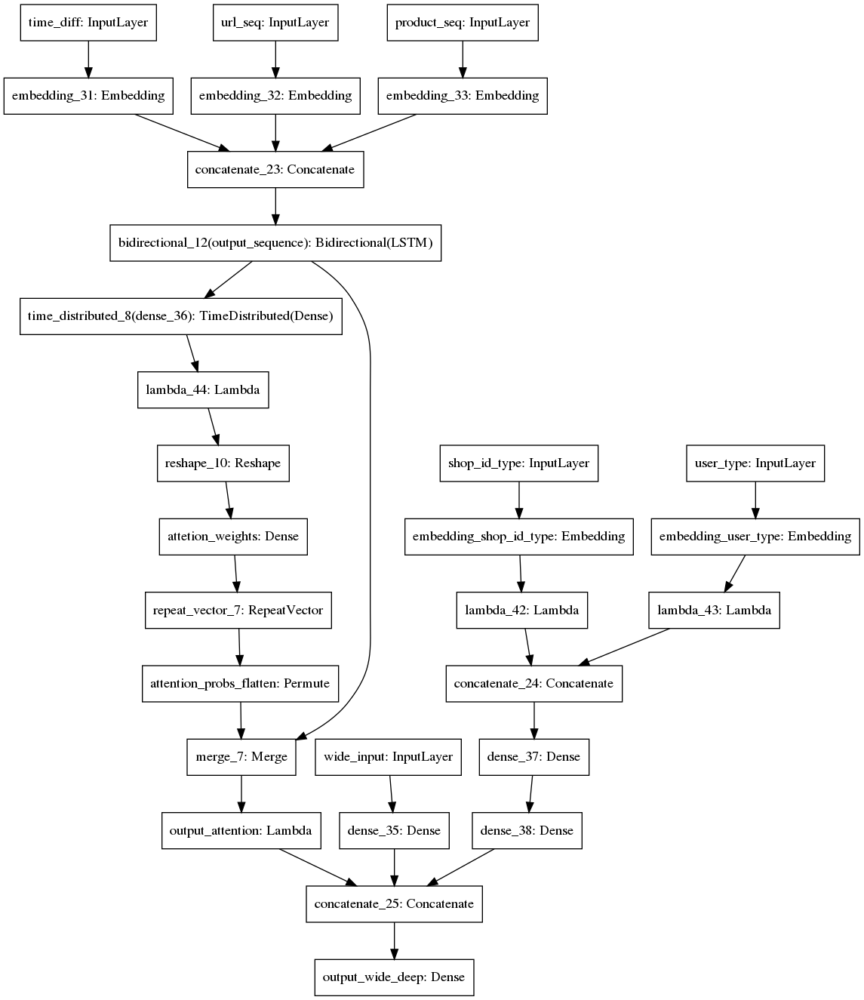

# Wide And Deep Frame
   

Content:  
可以方便定制化的 Wide And Deep 框架， 各种特征编码方式正在完善。

Include:  
- [x] **Wide And Deep Model**
- [x] **Sequence Model**
- [x] **Attention Mechanism**

## Wide And Deep Model:  
**example for two deep branch**   
  

## Attention Mechanism 
**simplest attention in Dense**  

**simplest multi attention in lstm**  
i.e. single attention vector is flase   
Attention defined per time series (each TS has its own attention)  
  
**Attention shared across all the time series**  
  

## Wide And Deep & Sequence & Attention
**example for two deep branch and three sequence branch**  
